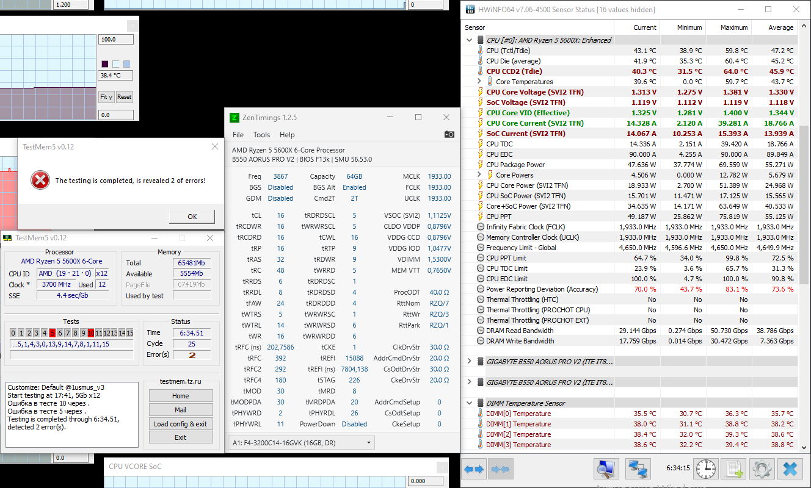

- [TestMem5 automate](#testmem5-automate)
- [Example results](#example-results)
- [Usage](#usage)
- [Caveats](#caveats)

# TestMem5 automate

This is a script to automate running [TestMem5](https://testmem.tz.ru/testmem5.htm) (:ru:) RAM testing utility (aka TM5). Script aims to do the following:

1. Take screenshot of area containing all windows with specified titles.
   Like `HWiNFO*Sensor Status*` or `ZenTimings*` or `TestMem5*`
2. Collect information from TestMem5 interface
   - Current cycle
   - Number of errors
   - Log entries appeared on current cycle
3. Store that information in files or filenames
4. Do that only between TM5 cycles.

# Example results

Script output for the run above is [in Example folder](Example). Note how there are only 4 log files, because TM5 wrote some log only during 1, 2, 17, and 25 cycles.

# Usage

The script is intended to be run once regularly when TestMem5 test cycles end. One easy way to catch them is to use [HWiNFO](https://www.hwinfo.com/) and its alert feature. You'd probably run HWiNFO anyway to monitor RAM temperatures :roll_eyes: 

1. Download Screenshot-Windows.ps1 and put it to a directory of choice. Whatever files it creates would also reside in that directory
2. Open HWiNFO64 sensors
3. Locate `Physical Memory Available` sensor
4. Press right mouse button on it, select `Alert settings...`
5. Now setup alert so that it runs the script once per TestMem5 cycle end:
   1. Set `If value >=` to something around `2000`. It's expected that your PC would have that much free RAM only before and after TestMem5 whole run, and between its cycles when it deallocates and the allocates again all the memory needed. Possible exception: when you start some heavy process before starting TM5, e.g. Firefox, and then close that process. ?In such situation, you'll have more free RAM and alert would fire.
   2. Set `Run a Program` to `c:\Windows\System32\WindowsPowerShell\v1.0\powershell.exe`
   3. Set `Arguments:` to `-WindowStyle Hidden -ExecutionPolicy Bypass <PATH\TO\SCRIPT>\Screenshot-Windows.ps1 '"HWiNFO*Sensor Status*"' "ZenTimings*" "TestMem5*"`
      - The script takes wildcard patterns for windows to take screenshots of. Note that for patterns with spaces single quotes are needed.
      - if you need to debug the script, you can replace `-WindowStyle Hidden` with `-noexit`
   4. Set `Notification distance` as needed. It :red_circle: ***must*** :red_circle: be lower that the time it takes TM5 to pass ***one*** cycle on your _current RAM settings_. It should also be longer than it takes TM5 to reallocate memory between cycles. I'm setting the distance to 600 seconds (and one TM5 cycle is near 15 minutes for my 64GB RAM kit). That way, if I debug the script and forget to disable alerts while TM5 is not testing, screenshots would only be saved once in 10 minutes.
   5. Don't change `Samples to trigger` or `Trigger only once` from defaults.

# Caveats

1. The script closes HWiNFO when it detects two TM5 windows, so that alerts no longer fire after TM5 run ends. Put `#` before `Stop-Process -Name "HWiNFO*"` if you don't want that. 
2. No check is made if windows are visible or not. This ensures that HWiNFO window get restored from tray instead of being ignored. But that also means you can accidentally screenshot windows you didn't mean to, or end up having larger screenshots than required.
3. Taking screenshots correctly appears to be hard on Windows 10 :laughing: The code involved is DPI unaware and might also not work on multimonitor setups.
4. Encoding problems of TM5 log, seen from some of the screenshots around, are not taken into account, so saved log might as well have them.
5. If you are running TM5 on a remote machine and connect via RDP and then minimize RDP window, the script, once run, will disconnect RDP session. Reason and possible solution [here](https://stackoverflow.com/a/35193691). But that solution would result in minimized RDP sessions consuming more resources.
6. Sometimes free RAM alert fires not on the last test of a cycle but on the one before last, or even earlier. E.g. on 1usmus_v3 config sometimes one of the threads might finish prematurely on test 11. Also sometimes TM5 threads just crash, e.g. [1](https://www.overclock.net/threads/official-amd-ryzen-ddr4-24-7-memory-stability-thread.1628751/page-470#post-28827552), [2](https://www.overclock.net/threads/official-amd-ryzen-ddr4-24-7-memory-stability-thread.1628751/page-470#post-28827566), [3](https://www.overclock.net/threads/official-amd-ryzen-ddr4-24-7-memory-stability-thread.1628751/page-475#post-28828074). The latter is definitely instability of CPU/RAM, and would also be screenshot when alert fires. However since TM5 would never finish running, alerts would fire continuously and produce lots of the same screenshots.

